# 🚀 Auto Portfolio Deployment — CI/CD with AWS EC2 & Jenkins

<p align="center">
  
  
  
  
  
  
  
</p>

<p align="center">
  <strong>A fully automated CI/CD pipeline that deploys a personal portfolio website to an AWS EC2 instance using Jenkins and Apache — every time you push code to GitHub.</strong>
</p>

---

## 📖 Project Overview

This project demonstrates a **real-world DevOps workflow** by automating the deployment of a portfolio website. Instead of manually copying files to a server every time you make a change, a **CI/CD pipeline** handles everything automatically:

1. ✍️ You write code and push it to **GitHub**
2. 🔔 A **webhook** instantly notifies **Jenkins**
3. ⚙️ Jenkins **pulls** the latest code from the repository
4. 🚀 Jenkins **deploys** the files to **Apache** on an **EC2 instance**
5. 🌐 Your **live website** is updated within seconds

> No manual uploads. No SSH-ing into servers. Just push and deploy.

---

## 🏗️ Architecture Diagram

```mermaid
flowchart LR
    A["🧑‍💻 Developer\nPushes Code"] -->|git push| B["📦 GitHub\nRepository"]
    B -->|Webhook Trigger| C["⚙️ Jenkins\nCI/CD Server"]
    C -->|Pulls Latest Code| D["📥 Git Pull\non EC2"]
    D -->|Copies Files| E["🌐 Apache Web Server\n/var/www/html/"]
    E -->|Serves| F["🖥️ Live Portfolio\nWebsite"]

    style A fill:#4CAF50,stroke:#333,color:#fff
    style B fill:#24292e,stroke:#333,color:#fff
    style C fill:#D24939,stroke:#333,color:#fff
    style D fill:#0078D4,stroke:#333,color:#fff
    style E fill:#D22128,stroke:#333,color:#fff
    style F fill:#FF9900,stroke:#333,color:#fff
```



---

## 🛠️ Tech Stack

| Technology | Purpose |
|---|---|
| **HTML5 / CSS3 / JS** | Portfolio website front-end |
| **Vite** | Local development server with hot reload |
| **Git & GitHub** | Version control and remote repository |
| **Jenkins** | CI/CD automation server (Freestyle project) |
| **Apache2** | Production web server on EC2 |
| **AWS EC2** | Cloud hosting (Ubuntu 22.04 LTS, t2.micro) |
| **GitHub Webhooks** | Triggers Jenkins build on every `git push` |

---

## 📁 Folder Structure

```
auto-portfolio-deploy/
├── index.html          # Main portfolio page
├── style.css           # Styles (dark theme, animations)
├── script.js           # JavaScript interactions
├── package.json        # Vite dev tooling
├── vite.config.js      # Vite configuration
├── Jenkinsfile         # Pipeline-as-code (alternative to Freestyle)
├── .gitignore          # Git ignore rules
├── README.md           # This file
├── SETUP_GUIDE.md      # Complete EC2/Jenkins setup guide
└── assets/
    └── resume.pdf      # Downloadable resume
```

---

## ⚡ Quick Start — Local Development

Get the portfolio running on your local machine in under a minute:

```bash
# 1. Clone the repository
git clone https://github.com/justusfaby/auto-portfolio-deploy.git

# 2. Navigate into the project folder
cd auto-portfolio-deploy

# 3. Install dependencies (Vite dev server)
npm install

# 4. Start the local development server
npm run dev
```

🌐 Open your browser and visit: **http://localhost:5173**

> 💡 Vite provides **hot module replacement** — your changes appear instantly in the browser without refreshing!

---

## 🔄 CI/CD Workflow

Here's what happens every time you push code — fully automated, zero manual steps:

| Step | What Happens | Tool |
|---|---|---|
| **1️⃣ Push** | You push code to the `main` branch | Git / GitHub |
| **2️⃣ Webhook** | GitHub sends a POST request to Jenkins | GitHub Webhooks |
| **3️⃣ Build** | Jenkins pulls the latest code from the repo | Jenkins Freestyle Job |
| **4️⃣ Deploy** | Jenkins copies files to `/var/www/html/` | Shell Script in Jenkins |
| **5️⃣ Live** | Apache serves the updated portfolio | Apache2 on EC2 |

```
 You: git push origin main
  │
  ▼
 GitHub ──webhook──► Jenkins ──deploy──► Apache ──serves──► 🌍 Live Site
```

> 📋 **Want to set this up yourself?** Follow the complete **[SETUP_GUIDE.md](SETUP_GUIDE.md)** for step-by-step instructions.

---

## 📝 Git Commands Reference

A quick reference for the most common Git commands used in this project:

### 🔰 Getting Started

```bash
# Initialize a new Git repository
git init

# Clone an existing repository
git clone https://github.com/justusfaby/auto-portfolio-deploy.git
```

### 📤 Making Changes

```bash
# Check which files have changed
git status

# Stage all changed files for commit
git add .

# Stage a specific file
git add index.html

# Commit staged changes with a message
git commit -m "Update hero section with new tagline"

# Push commits to the remote repository
git push origin main
```

### 🔍 Viewing History

```bash
# View commit history
git log --oneline

# See what changed in each file
git diff
```

### 🌿 Branching (Optional)

```bash
# Create and switch to a new branch
git checkout -b feature/new-section

# Switch back to main branch
git checkout main

# Merge a branch into main
git merge feature/new-section
```

---

## 🔗 Useful Links

| Resource | Link |
|---|---|
| 🟠 AWS Free Tier | https://aws.amazon.com/free/ |
| 🔴 Jenkins Documentation | https://www.jenkins.io/doc/ |
| 🟣 Apache Docs | https://httpd.apache.org/docs/ |
| ⚡ Vite Documentation | https://vitejs.dev/guide/ |
| 🐙 GitHub Webhooks Guide | https://docs.github.com/en/webhooks |
| 📘 Git Handbook | https://guides.github.com/introduction/git-handbook/ |

---

## 📄 License

This project is licensed under the **MIT License** — you are free to use, modify, and distribute this project.

```
MIT License

Copyright (c) 2025 Justus Faby Jeyakumar

Permission is hereby granted, free of charge, to any person obtaining a copy
of this software and associated documentation files (the "Software"), to deal
in the Software without restriction, including without limitation the rights
to use, copy, modify, merge, publish, distribute, sublicense, and/or sell
copies of the Software, and to permit persons to whom the Software is
furnished to do so, subject to the following conditions:

The above copyright notice and this permission notice shall be included in all
copies or substantial portions of the Software.

THE SOFTWARE IS PROVIDED "AS IS", WITHOUT WARRANTY OF ANY KIND, EXPRESS OR
IMPLIED, INCLUDING BUT NOT LIMITED TO THE WARRANTIES OF MERCHANTABILITY,
FITNESS FOR A PARTICULAR PURPOSE AND NONINFRINGEMENT. IN NO EVENT SHALL THE
AUTHORS OR COPYRIGHT HOLDERS BE LIABLE FOR ANY CLAIM, DAMAGES OR OTHER
LIABILITY, WHETHER IN AN ACTION OF CONTRACT, TORT OR OTHERWISE, ARISING FROM,
OUT OF OR IN CONNECTION WITH THE SOFTWARE OR THE USE OR OTHER DEALINGS IN THE
SOFTWARE.
```

---

## 👤 Author

**Justus Faby Jeyakumar**

- 📧 Email: [justusfaby@gmail.com](mailto:justusfaby@gmail.com)
- 🐙 GitHub: [github.com/justusfaby](https://github.com/justusfaby)
- 💼 LinkedIn: [linkedin.com/in/justusfaby](https://linkedin.com/in/justusfaby)

Built as a DevOps portfolio project to demonstrate CI/CD, cloud deployment, and automation skills.

---

<p align="center">
  <em>⭐ If you found this project helpful, feel free to star it on GitHub!</em>
</p>
